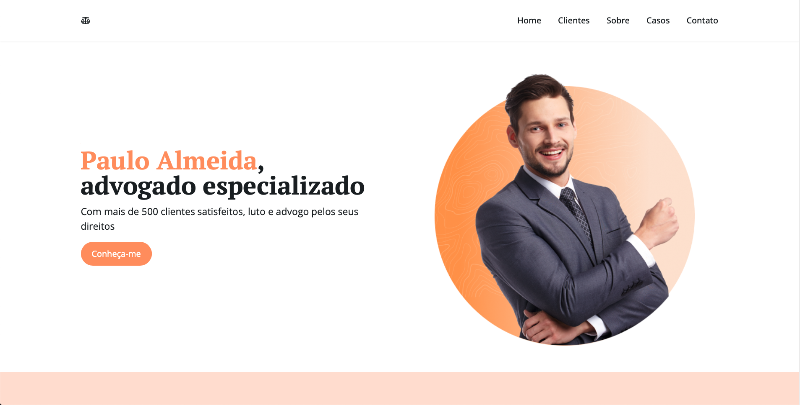

# Advogado | Landing Page




> Uma Landing Page (Página de Conversão ou Captura) de um advogado fictício. Feita com tecnologias modernas, visando melhorar a usabilidade e SEO.

### Ajustes e melhorias

O projeto encontra-se em constante desenvolvimentp e as próximas atualizações serão voltadas nas seguintes tarefas:

- [ ] Remover textos de preenchimento
- [ ] Incluir textos reais

## 💻 Pré-requisitos

Antes de começar, verifique se você atendeu aos seguintes requisitos:

* Você instalou a versão estável ou a mais recente do `Node.js`

## 🚀 Instalando o projeto

Para clonar o projeto em sua máquina, siga estas etapas:

Windows, Linux e macOS:
```
git clone https://github.com/Nelson-DevStack/advogado
cd advogado
yarn
```

## ☕ Executando o projeto

Para executar o projeto no servidor local (localhost:3000), execute o comando:

```
yarn run dev
```


[⬆ Voltar ao topo](#nome-do-projeto)<br>